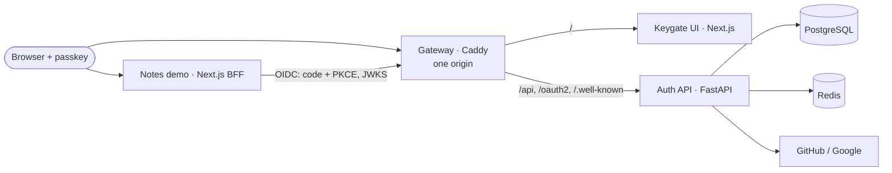

# Keygate

> A passkey-first, self-hostable identity provider: phishing-resistant sign-in with WebAuthn,
> MFA and recovery, social login, RBAC with an audit log, and a standards-compliant
> OpenID Connect provider that other apps can "Sign in with".

[](https://github.com/HariprasadG92/Passkey_First_authentication_keygate/actions/workflows/ci.yml)

[](LICENSE)


> **Demo GIF placeholder.** Record about 60 seconds at 1280×720 showing: (1) sign up at
> `localhost/signup`, open the link in Mailpit, create a passkey (Touch ID / Windows Hello);
> (2) sign out and sign back in with the passkey, no username; (3) on the account page, add an
> authenticator app and generate recovery codes (note the "Confirm it's you" prompt); (4) open
> the Notes app at `127.0.0.1:3001`, click **Sign in with Keygate**, approve consent, add a
> note; (5) sign out from Notes and show you're signed out of Keygate too. Save it as
> `docs/images/demo.gif`.

## Features

- **Passkeys first, no passwords at all.** WebAuthn registration and sign-in, usernameless
  (discoverable credentials) or email-first, user verification required, cloned-authenticator
  detection via sign counters, multiple passkeys per account.
- **Email verification by magic link.** Single-use, hashed, 15-minute tokens carried in the URL
  fragment; email can never bypass a passkey.
- **MFA and recovery.** TOTP fallback (encrypted at rest, replay-protected), 10 Argon2id-hashed
  single-use recovery codes, step-up re-authentication for sensitive actions, last-sign-in-method
  protection, security notification emails.
- **Sessions you can see.** Server-side sessions with rotation, idle and absolute timeouts,
  per-device list, revoke one or all others.
- **Social login.** GitHub (OAuth 2.0) and Google (OIDC) with state, PKCE, nonce and a
  browser binding; explicit, verified-email-only account linking (never silent merges).
- **RBAC, admin and audit.** Permission-based authorization, user directory, suspension,
  role assignment, session revocation, and a filterable, append-only audit log.
- **OpenID Connect provider.** Authorization Code + PKCE, consent, ES256 ID tokens, JWT access
  tokens, rotating refresh tokens with reuse detection, key rotation, RP-initiated logout,
  and a **Notes demo app** that signs in through Keygate.
- **Production hygiene.** Strict nonce-based CSP, CSRF protection, rate limits on every
  sensitive endpoint, non-root digest-pinned images, and CI with SAST, secret, dependency and
  image scanning.

## Architecture



A Caddy **gateway** serves the UI and API on a single origin, which WebAuthn and same-site
cookies need. The **FastAPI** service makes every security decision: WebAuthn verification,
sessions, CSRF, MFA, social login, RBAC, audit and the OIDC provider. **PostgreSQL** holds
durable state (tokens only as hashes; TOTP secrets and signing keys encrypted). **Redis** holds
short-lived, single-use state: challenges, authorization codes, OAuth state, rate limits.
The **Notes** app is an independent relying party.

Sequence diagrams for passkey registration, passkey sign-in and the OIDC flow are in
**[docs/ARCHITECTURE.md](docs/ARCHITECTURE.md)**.

## Security design

The full STRIDE analysis, with every mitigation linked to code and tests, is in
**[docs/THREAT_MODEL.md](docs/THREAT_MODEL.md)**; the reasoning behind each choice is in
**[docs/DECISIONS.md](docs/DECISIONS.md)** (43 ADRs). Highlights:

| Threat | Mitigation |
| --- | --- |
| Phishing and credential stuffing | Passkeys are bound to the origin; there are no passwords to steal or reuse. |
| Replayed or cloned authenticators | Single-use 5-minute challenges; sign-counter regression is refused and logged as high severity. |
| Session theft and fixation | HttpOnly `__Host-` cookies, rotation on every sign-in and privilege change, idle/absolute timeouts, hashed at rest. |
| XSS / CSRF | Per-request nonce CSP with `strict-dynamic`; session-bound signed double-submit CSRF tokens, default-deny. |
| Stolen session → takeover | Step-up re-authentication (≤ 5 min) for adding credentials, email change, recovery codes and admin actions. |
| Account enumeration | Identical responses, background email, decoy WebAuthn credentials. |
| Email as a backdoor | Magic links only create accounts without passkeys; recovery uses codes, not email. |
| OAuth code interception / login CSRF / mix-up | PKCE S256 everywhere, exact redirect URIs, single-use 60 s codes, browser-bound state, `iss` parameter. |
| Stolen refresh tokens | Rotation with family-wide revocation on reuse. |
| Privilege escalation / IDOR | Live permission checks on every request, owner-scoped lookups, a tested authorization matrix. |
| Tampered evidence | Append-only audit table enforced by a database trigger. |
| Supply chain | Lockfiles, digest/SHA pinning, Dependabot with cooldown, Semgrep, Gitleaks, pip-audit, pnpm audit and Trivy in CI. |

## Quick start

Requirements: Docker with Compose v2 and GNU Make. Five minutes, no manual steps beyond this:

```bash
git clone https://github.com/HariprasadG92/Passkey_First_authentication_keygate.git keygate && cd keygate
make dev        # creates .env from .env.example, builds and starts everything
```

| URL | What |
| --- | --- |
| <http://localhost> | Keygate UI |
| <http://localhost:8025> | Mailpit: the emails Keygate sends |
| <http://127.0.0.1:3001> | **Notes**: demo app that signs in with Keygate |
| <http://localhost/api/docs> | API docs (development only) |
| <http://localhost/.well-known/openid-configuration> | OIDC discovery |

1. Open <http://localhost/signup>, enter any email, and click the link in Mailpit.
2. **Confirm email**, then **Create passkey** (Touch ID, Windows Hello, a phone or a security key).
3. Sign out and **Sign in with a passkey**: no username needed.
4. Explore the account page: more passkeys, an authenticator app, recovery codes, sessions.
5. Open Notes and click **Sign in with Keygate**.
6. Make yourself an admin: `make admin email=you@example.com`.

Port 80 taken? Set `GATEWAY_PORT` **and** `KEYGATE_PUBLIC_URL` (e.g. `http://localhost:8080`)
in `.env`: WebAuthn checks the exact origin.

## OpenID Connect provider

Apps sign users in through Keygate the way they would with Okta or Entra ID:
**Authorization Code + PKCE** (S256, required for every client), consent, ES256-signed ID
tokens, short-lived JWT access tokens, rotating refresh tokens with reuse detection, and
RP-initiated logout.

| Endpoint | Path |
| -------- | ---- |
| Discovery | `/.well-known/openid-configuration` |
| Authorize | `/oauth2/authorize` |
| Token | `/oauth2/token` |
| UserInfo | `/oauth2/userinfo` |
| JWKS | `/oauth2/jwks` |
| Revocation | `/oauth2/revoke` |
| End session | `/oauth2/logout` |

Scopes: `openid`, `profile`, `email`, `notes:read`, `notes:write`.

**Try the demo**: open <http://127.0.0.1:3001>, click **Sign in with Keygate**, use your
passkey, approve the consent screen, and you're back in Notes, signed in. Notes keeps tokens
server-side only and calls its own API with the access token (backend-for-frontend pattern).
**Sign out** ends both sessions.

Register your own apps under **Apps** in the header (admins), or rotate the signing key with
`make rotate-keys`.

## Roles and administration

| Role      | Can                                                                  |
| --------- | -------------------------------------------------------------------- |
| `user`    | Manage their own account (every account has this)                    |
| `auditor` | Read the audit log and the user directory                            |
| `admin`   | Everything: search users, suspend/unsuspend, assign roles, revoke sessions, read the audit log |

Make yourself the first admin (there's deliberately no web path to do this):

```bash
make admin email=you@example.com      # or: make auditor email=...
```

Then **Users** and **Audit log** appear in the header. Admin actions ask you to re-confirm
with your passkey and are recorded in the audit log.

## Social login setup (optional)

Keygate runs fine without social login; the buttons only appear once a provider is configured.
Put the values in `.env`, then run `docker compose up -d api` to apply them.

### GitHub

1. Go to **GitHub → Settings → Developer settings → OAuth Apps → New OAuth App**
   (<https://github.com/settings/applications/new>).
2. Fill in:
   - **Application name**: `Keygate (local)`
   - **Homepage URL**: `http://localhost`
   - **Authorization callback URL**: `http://localhost/api/auth/social/github/callback`
3. Click **Register application**, then **Generate a new client secret**.
4. Add to `.env`:
   ```bash
   KEYGATE_GITHUB_CLIENT_ID=<Client ID>
   KEYGATE_GITHUB_CLIENT_SECRET=<Client secret>
   ```

Keygate asks for `read:user user:email` and only trusts your **primary, verified** GitHub email.

### Google

1. Open the Google Cloud console (<https://console.cloud.google.com/>) and create or select a
   project.
2. **APIs & Services → OAuth consent screen**: choose **External**, fill in the app name and
   your email, add the scopes `openid`, `email` and `profile`, and add yourself as a **test
   user** (while the app is in "Testing").
3. **APIs & Services → Credentials → Create credentials → OAuth client ID**:
   - **Application type**: Web application
   - **Authorized JavaScript origins**: `http://localhost`
   - **Authorized redirect URIs**: `http://localhost/api/auth/social/google/callback`
4. Add to `.env`:
   ```bash
   KEYGATE_GOOGLE_CLIENT_ID=<...>.apps.googleusercontent.com
   KEYGATE_GOOGLE_CLIENT_SECRET=<Client secret>
   ```

If you changed `KEYGATE_PUBLIC_URL` (e.g. a different port), use that origin in the callback
URLs instead. Providers require an **exact** match.

### How linking works

- **New email**: "Continue with GitHub/Google" creates an account. Add a passkey right after.
- **Email already belongs to a Keygate account**: sign-in is refused. Accounts are never
  merged silently. Sign in with your passkey, then use **Link GitHub/Google** on the account
  page (you'll confirm the specific identity before it's linked).

## Tests and CI

```bash
make install    # host toolchains: uv, pnpm deps, Playwright browser, git hooks
make lint       # ruff, mypy --strict, eslint, prettier, tsc (API, UI, Notes)
make test       # pytest + Playwright smoke + full-stack E2E
make test-e2e   # browser E2E only
```

- **API: about 310 tests, ~95% coverage**, against real PostgreSQL and Redis. A software WebAuthn
  authenticator produces real P-256 signatures, so the cryptographic checks run for real.
  Social providers are mocked at the HTTP layer with real RS256 ID tokens. Abuse cases are
  first-class: replays, races, IDOR, CSRF, brute force, token reuse. Critical checks were
  mutation-tested.
- **E2E (Playwright):** passkeys via the Chrome DevTools Protocol **virtual authenticator**,
  magic links read from Mailpit, MFA, step-up, admin, the full OIDC round trip with Notes, and
  security headers through the gateway.
- **CI on every push and PR** ([workflow](.github/workflows/ci.yml)): lint and types; API tests
  with Postgres/Redis service containers and an 80% coverage gate; full-stack E2E on the
  production images; **Semgrep**, **Gitleaks** (full history), **pip-audit**, **pnpm audit** and
  **Trivy** (filesystem, IaC and every image); production image builds that are smoke-booted
  as non-root. Dependabot keeps everything current.
- **Pre-commit hooks** run the linters, type checkers and Gitleaks before every commit.

## What I learned

> *Draft bullets: rewrite these in your own words.*

- Why passkeys resist phishing: the browser binds every assertion to the origin and the
  authenticator binds the key to the RP ID, so there's nothing a fake site can replay.
- How much of authentication security lives *around* the cryptography: single-use
  challenges, session rotation, CSRF binding, step-up, and safe recovery paths.
- That "verify after you trust" matters: the sign-counter check only means something after
  the signature has been verified.
- OAuth 2.1 in practice: PKCE for everyone, exact redirect URIs, refresh-token rotation with
  reuse detection, and why `state` alone doesn't stop login CSRF.
- Designing for revocation: server-side sessions and live permission checks versus the
  convenience of self-contained JWTs.
- Race conditions are security bugs: the last-admin and last-passkey rules needed row locks,
  and tests that fire requests concurrently.
- Writing tests that attack the system (replays, IDOR, token reuse), and mutation-testing
  them to prove they'd catch a regression.
- Supply-chain hygiene: pinning, cooldowns, and scanning images, not just dependencies.

## Roadmap

- WebAuthn **attestation verification with FIDO MDS** (allow-list certified authenticators).
- **Admin MFA enforcement policies** (e.g. require passkey-only step-up for admins).
- **SCIM 2.0** user provisioning and **SAML 2.0** for legacy service providers.
- **Device-bound session credentials** (DBSC) to make stolen cookies useless.
- OIDC: PAR/JAR, DPoP-bound tokens, pairwise subject identifiers, back-channel logout,
  token introspection.
- Conditional UI (passkey autofill) and passkey upgrade prompts.
- External audit log sink (SIEM / WORM storage) and KMS-backed keys.

## Repository layout

```
apps/api         FastAPI auth service (Python 3.12, SQLAlchemy 2 async, Alembic)
apps/web         Keygate UI (Next.js 15, Tailwind, shadcn/ui)
apps/demo-notes  Demo relying party (Next.js, openid-client, BFF)
infra/gateway    Caddy: one origin for UI + API + OIDC
docs/            ARCHITECTURE, THREAT_MODEL, DECISIONS (ADRs), API reference
```

## Security

Found a vulnerability? Please report it privately: see [SECURITY.md](SECURITY.md).

## License

[MIT](LICENSE)
