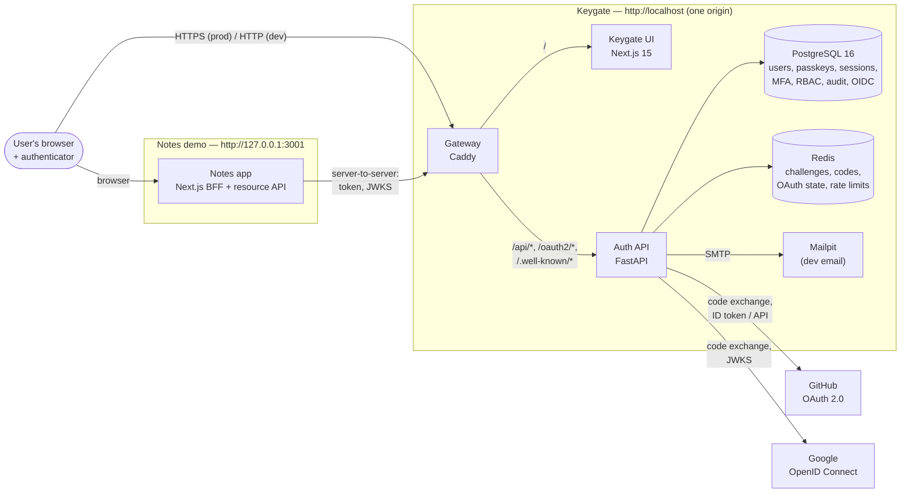
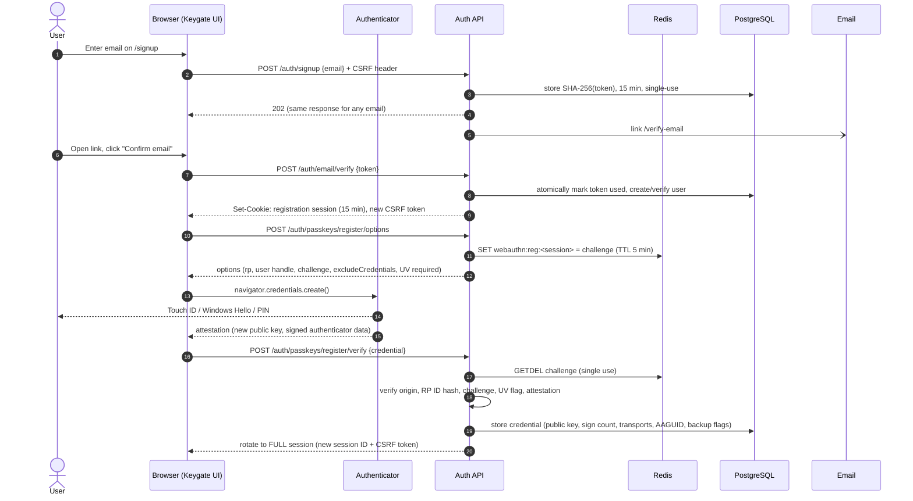

# Architecture

Keygate is a self-hostable identity provider built around passkeys. This document explains
how the pieces fit together and walks through the three flows that matter most: passkey
registration, passkey sign-in, and "Sign in with Keygate" (OpenID Connect).

Design decisions and their trade-offs are recorded in [DECISIONS.md](DECISIONS.md); threats
and mitigations in [THREAT_MODEL.md](THREAT_MODEL.md).

## System overview



| Component | Responsibility |
| --- | --- |
| **Gateway** (Caddy) | Puts the UI and the API on **one origin**, which WebAuthn and same-site cookies need. Routes `/api/*` (prefix stripped), `/oauth2/*` and `/.well-known/*` to the API, everything else to the UI. Sets `X-Forwarded-For` from the real peer. |
| **Keygate UI** (Next.js) | Sign-up, sign-in, account security, admin and consent pages. Runs passkey ceremonies with `@simplewebauthn/browser`. Holds no secrets: the session cookie is HttpOnly. Per-request nonce CSP. |
| **Auth API** (FastAPI) | All security decisions: WebAuthn verification (py_webauthn), sessions, CSRF, MFA, social login, RBAC, audit log, and the OpenID Connect provider. |
| **PostgreSQL** | Durable state. Secrets are stored as hashes (session tokens, magic links, refresh tokens, client secrets: SHA-256; recovery codes: Argon2id) or encrypted (TOTP secrets, signing keys: AES-256-GCM). The audit table is append-only (trigger). |
| **Redis** | Short-lived, single-use state with TTLs: WebAuthn challenges (5 min), authorization codes (60 s), OAuth/OIDC flow state (10 min), pending consent and links, rate-limit counters, revoked access-token IDs. |
| **Notes** (demo RP) | A third-party app that signs in only through Keygate (Authorization Code + PKCE) as a confidential client, using the backend-for-frontend pattern, and exposes its own resource API protected by Keygate access tokens. |

### Code map

```
apps/api/src/keygate/
├── main.py              app factory: middleware, routers, lifespan (DB, Redis, HTTP client)
├── config.py            typed settings; refuses weak configuration in production
├── security/            middleware (headers, request IDs, safe 500s), CSRF, rate limiting,
│                        token hashing, AES-GCM encryption, client info
├── auth/                users, passkeys (WebAuthn), magic links, sessions, step-up,
│                        sign-in-method rules, notifications
├── mfa/                 TOTP (encrypted, replay-protected), Argon2id recovery codes
├── social/              GitHub/Google providers, OAuth flow with PKCE/state/nonce/binding
├── rbac/                roles, permissions, require_permission()
├── oidc/                OIDC provider: clients, keys (JWKS/rotation), tokens, codes, refresh
├── audit/               append-only audit log
├── api/                 HTTP routers (auth, account, social, admin, admin_clients, oidc, health)
├── db/                  SQLAlchemy base/session, Alembic migrations
└── cli.py               operator commands: grant-role, ensure-client, rotate-signing-key
```

## Passkey registration (sign-up)

New accounts start with an email link, then register their first passkey. Email only ever
creates a short-lived *registration* session that can enrol that first passkey, never a
full session (ADR-012).



## Passkey sign-in

Usernameless sign-in uses *discoverable credentials*: the authenticator offers the passkeys it
holds for `localhost`, and the user picks one. Email-first sign-in sends the user's credential
IDs (or HMAC-derived decoys for unknown emails, ADR-013).

```mermaid
sequenceDiagram
    autonumber
    actor U as User
    participant B as Browser
    participant A as Authenticator
    participant API as Auth API
    participant R as Redis
    participant DB as PostgreSQL

    B->>API: POST /auth/passkeys/login/options {email?}
    API->>R: SET webauthn:auth:<sha256(ceremony_id)> = challenge (TTL 5 min)
    API-->>B: {ceremony_id, options (challenge, allowCredentials, UV required)}
    B->>A: navigator.credentials.get()
    A-->>U: verify user (biometric / PIN)
    A-->>B: assertion signed over (authenticatorData ‖ SHA-256(clientDataJSON))
    B->>API: POST /auth/passkeys/login/verify {ceremony_id, credential}
    API->>R: GETDEL challenge (replay impossible)
    API->>DB: load credential by ID (row lock)
    API->>API: verify user handle, origin, RP ID, challenge, UV, signature
    alt sign counter went backwards (and isn't 0/0)
        API->>DB: audit credential.sign_count_regression (HIGH)
        API-->>B: 400 generic failure
    else valid
        API->>DB: update sign count / last used; revoke old session; create new session
        API->>DB: audit signin success
        API-->>B: Set-Cookie: new session ID (HttpOnly, SameSite=Lax) + CSRF token
    end
```

## "Sign in with Keygate" — OpenID Connect, Authorization Code + PKCE

The Notes demo is a confidential client using the backend-for-frontend pattern: tokens stay
on the Notes server. Keygate requires PKCE (S256) from every client.

```mermaid
sequenceDiagram
    autonumber
    actor U as User
    participant NB as Browser on Notes
    participant N as Notes server (BFF)
    participant K as Keygate (UI + API)
    participant NA as Notes resource API

    U->>NB: Click "Sign in with Keygate"
    NB->>N: GET /api/auth/login
    N->>N: create state, nonce, PKCE verifier → encrypted cookie<br/>challenge = BASE64URL(SHA256(verifier))
    N-->>NB: 307 → /oauth2/authorize?response_type=code&client_id&redirect_uri<br/>&scope&state&nonce&code_challenge&code_challenge_method=S256
    NB->>K: GET /oauth2/authorize
    K->>K: validate client + exact redirect_uri (else error page, no redirect),<br/>PKCE S256, scopes
    opt not signed in to Keygate
        K-->>NB: → /signin?next=/oauth2/authorize?…
        U->>K: passkey sign-in (see above)
    end
    opt no prior consent for these scopes
        K-->>NB: → /consent#request=…
        U->>K: Allow (POST /oauth2/consent, CSRF-protected)
    end
    K->>K: code (256 bits) → Redis, TTL 60 s, bound to client,<br/>redirect URI, PKCE challenge, nonce, user
    K-->>NB: 303 → redirect_uri?code&state&iss
    NB->>N: GET /api/auth/callback?code&state&iss
    N->>N: check state and iss
    N->>K: POST /oauth2/token (client_secret_basic, code, redirect_uri, code_verifier)
    K->>K: GETDEL code; check client, redirect URI, SHA256(verifier) == challenge
    K-->>N: id_token (ES256), access_token (at+jwt, 10 min), refresh_token (rotating)
    N->>K: GET /oauth2/jwks (cached)
    N->>N: verify ID token: signature, iss, aud, exp, nonce → encrypted session cookie
    N-->>NB: 302 → / (signed in; no tokens in the browser)
    NB->>N: GET /bff/notes
    N->>NA: GET /api/notes, Authorization: Bearer access_token
    NA->>NA: verify signature (JWKS), typ at+jwt, iss, aud=notes-api, exp, scope notes:read
    NA-->>N: notes
    N-->>NB: notes
```

**Refresh.** When the access token is close to expiry, the BFF calls the token endpoint with
the refresh token. Keygate rotates it (the old one becomes single-use history). If a rotated
token is ever presented again, Keygate revokes the whole token family (ADR-039).

**Sign-out.** Notes clears its session and redirects to `/oauth2/logout` with the ID token as
`id_token_hint`. Keygate ends its own session, revokes that client's refresh tokens, and
redirects only to a registered `post_logout_redirect_uri` (ADR-041).

## Request pipeline (API)

Every API request passes through the same layers, outermost first:

1. **Gateway**: sets `X-Forwarded-For` from the real peer; uvicorn trusts it only from the
   gateway's fixed IP (ADR-003).
2. **SecurityMiddleware** (raw ASGI): validated request ID, structured access log without
   query strings, security headers on every response, generic 500s (ADR-005).
3. **CSRF dependency** (global, default-deny): signed double-submit token bound to the
   session for every state-changing request, except back-channel OAuth endpoints (ADR-010).
4. **Route dependencies**: session loading (idle/absolute timeouts), `require_permission(...)`,
   step-up (`reauthenticated_at` within 5 minutes), rate limits.
5. **Handlers**: business logic; failures audited in their own transaction (ADR-017).

## Data model

```mermaid
erDiagram
    users ||--o{ webauthn_credentials : has
    users ||--o{ sessions : has
    users ||--o| totp_credentials : has
    users ||--o{ recovery_codes : has
    users ||--o{ social_accounts : links
    users ||--o{ user_roles : has
    roles ||--o{ user_roles : grants
    roles ||--o{ role_permissions : bundles
    permissions ||--o{ role_permissions : in
    users ||--o{ oauth_consents : gives
    oauth_clients ||--o{ oauth_consents : receives
    oauth_clients ||--o{ oauth_refresh_tokens : issued
    users ||--o{ oauth_refresh_tokens : owns
    users ||--o{ email_tokens : "email change"

    users { uuid id PK; text email UK; bool email_verified; enum status; bytes webauthn_user_handle UK }
    webauthn_credentials { uuid id PK; bytes credential_id UK; bytes public_key; bigint sign_count; text[] transports; text aaguid; bool backup_eligible; bool backup_state }
    sessions { uuid id PK; bytes token_hash UK; enum level; timestamptz last_seen_at; timestamptz expires_at; timestamptz reauthenticated_at }
    totp_credentials { uuid user_id PK; text encrypted_secret; bigint last_used_step }
    recovery_codes { uuid id PK; text code_hash; timestamptz used_at }
    social_accounts { uuid id PK; text provider; text subject; bool email_verified }
    oauth_clients { uuid id PK; text client_id UK; bytes client_secret_hash; text[] redirect_uris }
    oauth_refresh_tokens { uuid id PK; bytes token_hash UK; uuid family_id; timestamptz used_at; timestamptz revoked_at }
    audit_events { uuid id PK; text event_type; enum severity; enum result; uuid actor_user_id; uuid target_user_id; jsonb details }
    oidc_signing_keys { text kid PK; text public_jwk; text encrypted_private_jwk; timestamptz retired_at }
```

`audit_events` and `oidc_signing_keys` have no foreign keys on purpose: audit history must
outlive the users it mentions, and keys are global.

## Deployment notes

The repository ships a development stack (`docker compose`). For production:

- Terminate TLS at the gateway (Caddy can obtain certificates automatically), set
  `KEYGATE_ENVIRONMENT=production`, and use `https` for `KEYGATE_PUBLIC_URL` and
  `KEYGATE_WEBAUTHN_ORIGINS`. The app refuses to start otherwise (ADR-006).
- Generate unique values for `KEYGATE_SECRET_KEY`, `KEYGATE_ENCRYPTION_KEYS` and the database
  and Redis passwords. Prefer a KMS/HSM for the encryption keys.
- Use the `runtime` image targets (non-root, no compilers or package managers), run
  `alembic upgrade head` as a one-off job, and give the app's database role no `TRUNCATE`
  or `DELETE` on `audit_events`.
- Rotate signing keys periodically with `python -m keygate.cli rotate-signing-key`.
