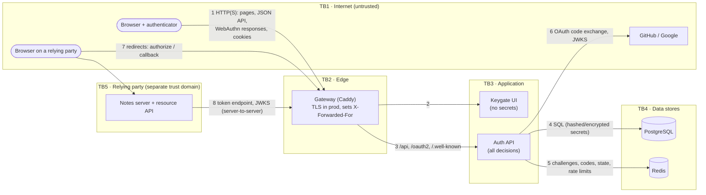

# Threat model (STRIDE)

This is the threat model for Keygate as built in this repository: an identity provider whose
compromise means compromise of every account and every relying party. It lists what we
protect, where trust changes hands, the threats per component (STRIDE), and how each one is
mitigated, with links to the code and tests. Residual risks are stated plainly at the end.

STRIDE: **S**poofing · **T**ampering · **R**epudiation · **I**nformation disclosure ·
**D**enial of service · **E**levation of privilege.

## 1. Assets

| # | Asset | Why it matters |
| - | ----- | -------------- |
| A1 | Session cookies | Bearer credential for a signed-in account. |
| A2 | Passkey public keys + sign counters | Integrity matters: swapping a public key = account takeover. |
| A3 | TOTP secrets | Anyone holding one can mint valid codes. |
| A4 | Recovery codes | One-shot account access. |
| A5 | Magic-link / email-change tokens | Create accounts or change the recovery address. |
| A6 | OIDC signing private keys | Forge ID/access tokens for **every** relying party. |
| A7 | Authorization codes, refresh tokens, client secrets | Mint tokens for a user or impersonate a client. |
| A8 | Audit log | Evidence; must be complete and unaltered. |
| A9 | PII: emails, names, IPs, user agents | Privacy; also used for enumeration. |
| A10 | Server secrets: `KEYGATE_SECRET_KEY`, encryption keys, DB/Redis passwords | Master keys for A1–A7. |

## 2. Actors

- **Anonymous internet attacker**: can send any HTTP request, run phishing sites, get victims
  to click links or visit pages (CSRF, login CSRF, open redirects).
- **Malicious or compromised relying party**: a registered OIDC client acting in bad faith,
  or one whose redirect handler leaks codes.
- **Authenticated malicious user**: holds a normal account, probes other users' objects (IDOR)
  and tries to escalate.
- **Insider / stolen session**: has a valid session cookie but not the user's devices.
- **Attacker with database read access**: SQL injection, a leaked backup, a replica.
- **Malicious dependency / image**: supply-chain compromise.

## 3. Data flow and trust boundaries

| Boundary | What crosses it | Primary controls |
| -------- | --------------- | ---------------- |
| TB1 → TB2 | Every user request | TLS (prod), security headers, rate limits, trusted-proxy IP |
| TB2 → TB3 | Proxied requests | Only the gateway's fixed IP may set `X-Forwarded-For`; the API port is not published |
| TB3 → TB4 | Queries, cached state | Least data: hashes instead of tokens, AES-GCM for secrets that must be recoverable |
| TB3 ↔ external IdPs | OAuth/OIDC responses | State, PKCE, nonce, browser binding, ID token validation |
| TB1/TB5 ↔ TB3 (OIDC) | Codes, tokens, redirects | Exact redirect URIs, PKCE, client auth, audience-restricted tokens |

## 4. Threats and mitigations by component

Status: ✅ mitigated · ⚠️ partially mitigated / accepted risk (see §5).

### 4.1 Passkey registration and sign-in (WebAuthn)

| STRIDE | Threat | Mitigation | Where |
| --- | --- | --- | --- |
| S | Phishing site relays a sign-in | Origin and RP ID are checked by the browser *and* the server; passkeys are scoped to the RP ID, so a look-alike domain can't get a valid assertion. | [`auth/passkeys.py`](../apps/api/src/keygate/auth/passkeys.py) · `test_origin_mismatch_rejected`, `test_rp_id_mismatch_rejected` ✅ |
| S | Replay of a captured assertion | Random 32-byte challenge, single use (`GETDEL`), 5-minute TTL. | `_take_challenge` · `test_assertion_replay_rejected`, `test_expired_challenge_rejected` ✅ |
| S | Cloned authenticator | Sign-counter regression after signature verification → refuse + HIGH audit event. | `_verify_assertion` · `test_sign_count_regression_flags_cloned_authenticator` ✅ |
| S | Device without user verification | `userVerification: required`, enforced server-side. | `test_user_verification_required` ✅ |
| S | Assertion from another user's credential (step-up) | Step-up checks the credential's owner and the user handle. | `test_step_up_with_someone_elses_passkey_rejected` ✅ |
| T | Tampered credential JSON | Strict Pydantic schemas (size limits, base64url), then cryptographic verification. | [`auth/schemas.py`](../apps/api/src/keygate/auth/schemas.py) ✅ |
| I | Account enumeration via email-first options | HMAC-derived decoy credential IDs for unknown emails. | `_decoy_descriptors` · `test_unknown_email_gets_stable_decoy_options` ⚠️ (credential count differs, ADR-013) |
| E | Same authenticator registered twice | `excludeCredentials` + unique credential ID constraint. | `test_add_passkey_excludes_existing_credentials` ✅ |

### 4.2 Email links (sign-up, email change)

| STRIDE | Threat | Mitigation | Where |
| --- | --- | --- | --- |
| S | Email as a passkey bypass | Links only for accounts without a passkey; re-checked on use. | [`auth/accounts.py`](../apps/api/src/keygate/auth/accounts.py) · `test_link_cannot_bypass_passkey_registered_later` ✅ |
| I | Token leaks via logs, Referer, proxies | Token in the URL **fragment**; page wipes it; stored as SHA-256. | `test_magic_link_token_stored_hashed_and_link_uses_fragment`, E2E `signUp` assertions ✅ |
| S | Link scanners / previews consume or use the link | Spending requires a POST from an explicit click. | [`verify-email/page.tsx`](../apps/web/src/app/verify-email/page.tsx) ✅ |
| T | Replay / brute force | 256-bit, single-use (atomic update), 15-minute TTL, newest link only, rate-limited. | `test_magic_link_is_single_use`, `test_only_newest_link_is_valid` ✅ |
| I | Enumeration via sign-up | Identical 202 response; email sent in the background. | `test_signup_response_identical_for_existing_account` ✅ |
| S | Email change to an attacker's address | Step-up, link to the new address, notice to the old one, link usable only by the same signed-in user. | `test_email_change_link_useless_to_another_user` ✅ |

### 4.3 Sessions and CSRF

| STRIDE | Threat | Mitigation | Where |
| --- | --- | --- | --- |
| S | Session theft via XSS | HttpOnly cookie; nonce-based CSP with `strict-dynamic`. | [`security/csrf.py`](../apps/api/src/keygate/security/csrf.py), [`web/src/middleware.ts`](../apps/web/src/middleware.ts) · E2E cookie and CSP tests ✅ |
| S | Session fixation | New random session ID on every sign-in, privilege change and step-up. | `test_sign_in_rotates_session`, `test_step_up_with_passkey_rotates_session` ✅ |
| I | DB leak yields live sessions | Only SHA-256 of the token is stored. | `test_session_token_stored_hashed` ✅ |
| S | Long-lived stolen session | 30-minute idle, 12-hour absolute timeout; users see and revoke sessions. | `test_idle_timeout`, `test_absolute_timeout`, `test_revoke_all_other_sessions` ✅ |
| T | Cross-site request forgery | Signed double-submit token bound to the session, default-deny, plus `SameSite`. | `test_csrf.py` (planted cookie, wrong session, missing header) ✅ |
| E | Stolen cookie → persistent takeover | Step-up (≤ 5 minutes) for adding credentials, email change, recovery codes, admin actions. | [`auth/stepup.py`](../apps/api/src/keygate/auth/stepup.py) · `*_requires_step_up` tests ✅ |

### 4.4 MFA and recovery

| STRIDE | Threat | Mitigation | Where |
| --- | --- | --- | --- |
| S | TOTP brute force | 5 attempts / 15 min per account (shared budget), per-IP limits. | `test_totp_brute_force_rate_limited` ✅ |
| S | TOTP replay (shoulder-surfed / phished code) | Atomic `last_used_step` compare-and-set. | `test_reused_code_rejected`, `test_older_code_rejected_after_newer_one_used` ✅ |
| I | DB leak exposes TOTP secrets | AES-256-GCM, key ID for rotation, user ID as associated data. | [`security/crypto.py`](../apps/api/src/keygate/security/crypto.py) · `test_secret_encrypted_at_rest_and_bound_to_user` ✅ |
| I | DB leak exposes recovery codes | Argon2id (RFC 9106 low-memory profile). | `test_stored_as_argon2id_hashes` ✅ |
| T | Recovery code reuse | Single-use under row lock; regeneration deletes all old codes. | `test_recovery_sign_in_is_single_use`, `test_regenerating_invalidates_old_codes` ✅ |
| D | Lock-out by deleting every method | Last-method protection under a user row lock (race-tested). | `test_concurrent_deletes_cannot_remove_every_method` ✅ |
| S | Phished TOTP code used for sign-in | Inherent to TOTP. Notification emails, audit log, session list. | ⚠️ ADR-020 |

### 4.5 Social login (GitHub, Google)

| STRIDE | Threat | Mitigation | Where |
| --- | --- | --- | --- |
| S | Forged callback / login CSRF | Server-side single-use `state` + HttpOnly browser-binding cookie. | [`social/service.py`](../apps/api/src/keygate/social/service.py) · `test_login_csrf_callback_in_another_browser_rejected` (mutation-checked) ✅ |
| S | Intercepted authorization code | PKCE S256 for every provider. | `test_token_request_carries_matching_pkce_verifier` ✅ |
| S | Forged / replayed ID token | RS256 signature (JWKS), `iss`, `aud`, `exp`, `nonce`, `azp`. | `test_google_id_token_claims_validated`, `test_google_id_token_signed_by_wrong_key_rejected` ✅ |
| E | Account takeover via unverified provider email | Only verified emails; identities matched by `(provider, subject)`; never auto-merged; linking needs step-up + explicit confirmation. | `test_existing_email_is_never_merged_silently`, `test_github_without_verified_primary_email_cannot_sign_up` ✅ |

### 4.6 OpenID Connect provider

| STRIDE | Threat | Mitigation | Where |
| --- | --- | --- | --- |
| S | Code interception / injection | PKCE (S256 only) mandatory for every client; code bound to client + redirect URI + challenge. | [`oidc/flow.py`](../apps/api/src/keygate/oidc/flow.py) · `test_wrong_pkce_verifier_rejected` (mutation-checked) ✅ |
| S | Open redirect / code theft via redirect URI | Exact string match; unknown client or URI → error page, never a redirect. | `test_redirect_uri_must_match_exactly` ✅ |
| T | Code replay | 60 s, single use; replay revokes tokens issued from it. | `test_code_is_single_use_and_replay_revokes_tokens` ✅ |
| S | Stolen refresh token | Rotation; reuse revokes the whole family (HIGH audit event). | `test_refresh_token_reuse_revokes_family` (mutation-checked) ✅ |
| S | Token confusion (ID token as access token, token for API A at API B) | `typ: at+jwt`; audience restriction (`notes-api` only with notes scopes). | `test_id_token_cannot_be_used_as_access_token`, `test_public_client_uses_pkce_without_secret` ✅ |
| S | Mix-up attacks | `iss` parameter in authorization responses (RFC 9207). | `test_full_authorization_code_flow` ✅ |
| I | Signing key theft | Private JWKs encrypted at rest; rotation with `kid`; only public keys published. | [`oidc/keys.py`](../apps/api/src/keygate/oidc/keys.py) · `test_private_keys_encrypted_at_rest`, `test_signing_key_rotation` ✅ |
| I | Client secret disclosure | SHA-256 stored, shown once, rotatable. | `test_register_client_shows_secret_once_and_stores_hash` ✅ |
| S | Logout CSRF / open redirect on logout | Session ends only for a valid hint of the signed-in user; redirect only to a registered URI. | `test_logout_never_redirects_to_unregistered_uri`, `test_logout_hint_for_another_user_does_not_end_my_session` ✅ |
| S | Consent CSRF / request hijack | Consent is a CSRF-protected POST bound to the user who started it. | `test_consent_request_belongs_to_its_user` ✅ |
| E | Revoked access token still usable | Deny-list at Keygate's userinfo; third-party APIs accept until expiry (≤ 10 min). | ⚠️ ADR-038 |

### 4.7 RBAC and administration

| STRIDE | Threat | Mitigation | Where |
| --- | --- | --- | --- |
| E | Missing authorization check | Permission dependency on every admin route; full authorization matrix tested. | [`rbac/dependencies.py`](../apps/api/src/keygate/rbac/dependencies.py) · `test_authorization_matrix` (32 cases) ✅ |
| E | IDOR on own-account objects | Lookups always include `user_id`; foreign IDs → 404. | `test_cannot_touch_another_users_passkey`, `test_cannot_revoke_another_users_session` ✅ |
| E | Self-escalation / lock-out | No self role changes or self-suspension; last admin protected under a lock. | `test_two_admins_cannot_demote_each_other_to_zero` ✅ |
| E | Stale privileges | Permissions read from DB on every request; grants revoke target's sessions. | `test_revoking_a_role_takes_effect_immediately`, `test_granting_a_role_forces_fresh_sign_in` ✅ |
| E | "First user becomes admin" | First admin only via operator CLI. | [`cli.py`](../apps/api/src/keygate/cli.py) ✅ |
| T | Search injection | Parameterised SQL; `%`/`_` escaped in `LIKE`. | `test_search_wildcards_are_literal` ✅ |

### 4.8 Audit log and logging

| STRIDE | Threat | Mitigation | Where |
| --- | --- | --- | --- |
| R | User or admin denies an action | Actor, target, IP, user agent, request ID, result recorded for sign-ins, credential/MFA/role changes, suspensions, session revocation, token reuse, sign-counter regressions, authorization denials. | [`audit/service.py`](../apps/api/src/keygate/audit/service.py) ✅ |
| T | Tampering with audit history | DB trigger rejects `UPDATE`/`DELETE`; no HTTP write path (405); events written in their own transaction so failures are kept. | `test_audit_log_is_append_only`, `test_audit_log_is_read_only_over_http` ⚠️ (`TRUNCATE` and DB superusers, §5) |
| I | Secrets in logs | Redaction processor; no query strings in access logs; SQL parameters hidden. | [`logging_setup.py`](../apps/api/src/keygate/logging_setup.py) · `test_logging.py` ✅ |
| T | Log injection via request IDs | Inbound IDs must match `^[A-Za-z0-9._-]{8,64}$`. | `test_replaces_malformed_inbound_request_id` ✅ |

### 4.9 Platform: transport, gateway, API, supply chain

| STRIDE | Threat | Mitigation | Where |
| --- | --- | --- | --- |
| S | Client IP spoofing (bypass rate limits, poison audit) | `X-Forwarded-For` trusted only from the gateway's fixed IP; Caddy overwrites client values. | [`docker-compose.yml`](../docker-compose.yml), ADR-003 ✅ |
| D | Credential stuffing / brute force / email bombing | Redis rate limits per IP and per account on every sensitive endpoint. | `test_rate_limits.py` (every limit tested; guard test) ⚠️ (fixed-window burst, lock-out abuse) |
| I | Internals leaked in errors | Generic 500; validation errors never echo input; health checks reveal no details. | `test_unhandled_exception_returns_generic_500`, `test_validation_error_does_not_echo_input` ✅ |
| T/I | Clickjacking, MIME sniffing, mixed content | `frame-ancestors 'none'`, `X-Frame-Options`, `nosniff`, HSTS in prod. | E2E `headers.spec.ts` ✅ |
| E | Weak production configuration | Refuses to start with dev secrets/keys/passwords, non-Secure cookies or http origins. | [`config.py`](../apps/api/src/keygate/config.py) · `test_production_rejects_insecure_settings` ✅ |
| T | Malicious dependency / image | Lockfiles; pnpm build-script allow-list; images and Actions pinned by digest/SHA; Dependabot with 7-day cooldown; pip-audit, pnpm audit, Trivy, Semgrep, Gitleaks in CI. | [`.github/workflows/ci.yml`](../.github/workflows/ci.yml) ✅ |
| E | Container breakout impact | Non-root (uid 10001) runtime images without compilers or package managers. | CI image smoke test ✅ |

## 5. Residual risks and accepted trade-offs

1. **TOTP and recovery codes are phishable.** A user who types a TOTP code into a phishing
   site can be signed in to by the attacker, who could then use TOTP for step-up. Mitigations:
   notifications, audit, session revocation, and passkeys as the default. Future: admin policy
   to disable TOTP, or "passkey-only step-up".
2. **JWT access tokens can't be revoked instantly at third-party resource servers.** Bounded by
   the 10-minute lifetime (ADR-038). Introspection would trade latency and availability for this.
3. **Audit table vs a database superuser.** Triggers stop the application role, not a superuser
   or `TRUNCATE`. Production: run the app with a role lacking `TRUNCATE`/`DELETE` on
   `audit_events`, and ship events to an external append-only store (SIEM, WORM bucket).
4. **Rate limiting.** Fixed windows allow a 2× burst at boundaries. Per-account limits can be
   used to lock a victim out of TOTP/recovery sign-in for one window (passkey sign-in is not
   affected).
5. **Enumeration side channels.** Email-first sign-in reveals the *number* of passkeys of real
   accounts (ADR-013); timing differences are reduced (background email, dummy Argon2) but not
   proven constant-time.
6. **Secrets from environment variables.** Encryption keys and the signing-key KEK live in env
   vars. Production should use a KMS/HSM (the key-ID format supports swapping one in).
7. **No attestation verification.** Any authenticator model is accepted (`attestation: none`).
   Organisations that need certified hardware should add FIDO MDS checks (roadmap).
8. **Social-only accounts** are only as strong as the provider account (ADR-029).
9. **Development stack runs plain HTTP** on localhost with non-Secure cookies. Production
   configuration refuses this (ADR-006, ADR-016).

## 6. Review triggers

Revisit this model when adding: a new sign-in method or recovery path; a new OAuth grant or
client type; any endpoint that takes an object ID; new external integrations; or changes to
the cookie, CSP or proxy configuration.
